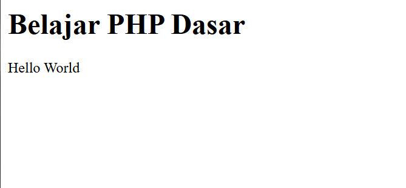
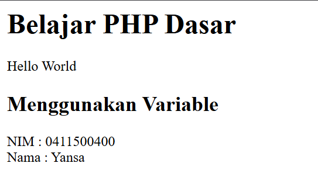
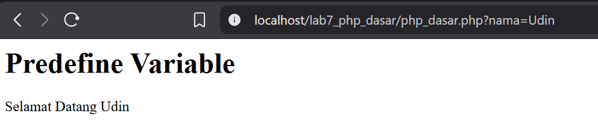
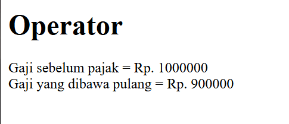
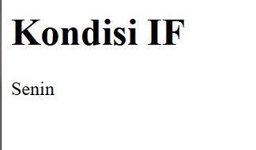
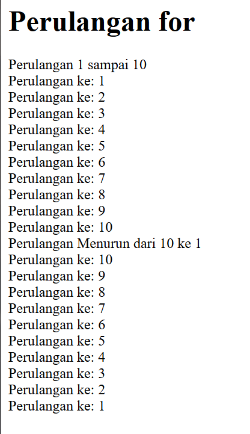
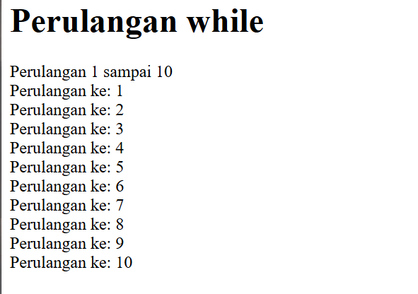
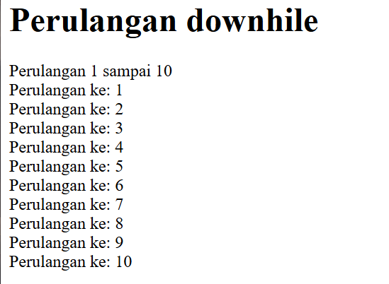
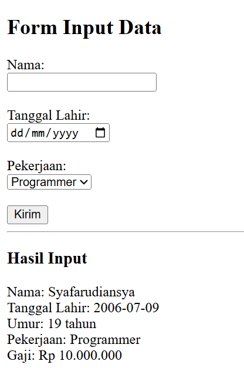

# Praktikum 7: PHP Dasar

## Nama: Syafarudiansya
## NIM: 312410381
## Kelas: TI 24 A6


## 1. PHP Dasar
Buat file baru dengan nama php_dasar.php pada directory tersebut. Kemudian buat
kode seperti berikut.
```php
<!DOCTYPE html>
<html lang="en">
<head>
<meta charset="UTF-8">
<title>PHP Dasar</title>
</head>
<body>
<h1>Belajar PHP Dasar</h1>
<?php
echo "Hello World";
?>
</body>
</html>
```


## 2. Variable PHP
Menambahkan variable pada program.
```php
<?php
$nim = "0411500400";
$nama = 'Yansa';
echo "NIM : " . $nim . "<br>";
echo "Nama : $nama";
?>
```


## 3. Predefine Variable $_GET
```php
<h1>Predefine Variable</h1>
<?php
echo 'Selamat Datang ' . $_GET['nama'];
?>
```


## 4. Membuat Form Input
```php
<!DOCTYPE html>
<html lang="en">
<head>
<meta charset="UTF-8">
<title>PHP Dasar</title>
</head>
<body>
<h2>Form Input</h2>
<form method="post">
<label>Nama: </label>
<input type="text" name="nama">
<input type="submit" value="Kirim">
</form>
<?php
echo 'Selamat Datang ' . $_POST['nama'];
?>
</body>
</html>
```


## 5. Operator
```php
<h1>Operator</h1>
<?php
$gaji = 1000000;
$pajak = 0.1;
$thp = $gaji - ($gaji*$pajak);
echo "Gaji sebelum pajak = Rp. $gaji <br>";
echo "Gaji yang dibawa pulang = Rp. $thp";
?>
```


## 6. Kondisi IF
```php
<h1>Kondisi IF</h1>
<?php
$nama_hari = date("l");
if ($nama_hari == "Sunday") {
echo "Minggu";
} elseif ($nama_hari == "Monday") {
echo "Senin";
} else {
echo "Selasa";
}
?>
```


## 7. Kondisi Switch
```php
<h1>Kondisi Switch</h1>
<?php
$nama_hari = date("l");
switch ($nama_hari) {
case "Sunday":
echo "Minggu";
break;
case "Monday":
echo "Senin";
break;
case "Tuesday":
echo "Selasa";
break;
default:
echo "Sabtu";
}
?>
```


## 8. Perulangan for
```php
<h1>Perulangan for</h1>
<?php
echo "Perulangan 1 sampai 10 <br />";
for ($i=1; $i<=10; $i++) {
echo "Perulangan ke: " . $i . '<br />';
}
echo "Perulangan Menurun dari 10 ke 1 <br />";
for ($i=10; $i>=1; $i--) {
echo "Perulangan ke: " . $i . '<br />';
}
?>
```


## 9. Perulangan while
```php
<h1>Perulangan while</h1>
<?php
echo "Perulangan 1 sampai 10 <br />";
$i=1;
while ($i<=10) {
echo "Perulangan ke: " . $i . '<br />';
$i++;
}
?>
```


## 10. Perulangan dowhile
```php
<?php
echo "Perulangan 1 sampai 10 <br />";
$i=1;
do {
echo "Perulangan ke: " . $i . '<br />';
$i++;
} while ($i<=10);
?>
```


# Pertanyaan dan Tugas
Buatlah program PHP sederhana dengan menggunakan form input yang menampilkan
nama, tanggal lahir dan pekerjaan. Kemudian tampilkan outputnya dengan menghitung
umur berdasarkan inputan tanggal lahir. Dan pilihan pekerjaan dengan gaji yang
berbeda-beda sesuai pilihan pekerjaan.
```php
<!DOCTYPE html>
<html>
<head>
  <title>Form Input Data</title>
</head>
<body>
  <h2>Form Input Data</h2>

  <form method="POST" action="">
    <label>Nama:</label><br>
    <input type="text" name="nama" required><br><br>

    <label>Tanggal Lahir:</label><br>
    <input type="date" name="tgl_lahir" required><br><br>

    <label>Pekerjaan:</label><br>
    <select name="pekerjaan" required>
      <option value="Programmer">Programmer</option>
      <option value="Desainer">Desainer</option>
      <option value="Guru">Guru</option>
      <option value="Dokter">Dokter</option>
      <option value="Petani">Petani</option>
    </select><br><br>

    <input type="submit" value="Kirim">
  </form>

  <hr>

  <?php
  if ($_SERVER["REQUEST_METHOD"] == "POST") {
      $nama = $_POST['nama'];
      $tgl_lahir = $_POST['tgl_lahir'];
      $pekerjaan = $_POST['pekerjaan'];

      // Hitung umur
      $today = new DateTime();
      $lahir = new DateTime($tgl_lahir);
      $umur = $today->diff($lahir)->y;

      // Gaji berdasarkan pekerjaan
      switch ($pekerjaan) {
          case "Programmer":
              $gaji = 10000000;
              break;
          case "Desainer":
              $gaji = 8000000;
              break;
          case "Guru":
              $gaji = 6000000;
              break;
          case "Dokter":
              $gaji = 15000000;
              break;
          case "Petani":
              $gaji = 4000000;
              break;
          default:
              $gaji = 0;
              break;
      }

      // Tampilkan hasil
      echo "<h3>Hasil Input</h3>";
      echo "Nama: $nama <br>";
      echo "Tanggal Lahir: $tgl_lahir <br>";
      echo "Umur: $umur tahun<br>";
      echo "Pekerjaan: $pekerjaan <br>";
      echo "Gaji: Rp " . number_format($gaji, 0, ',', '.') . "<br>";
  }
  ?>
</body>
</html>
```

